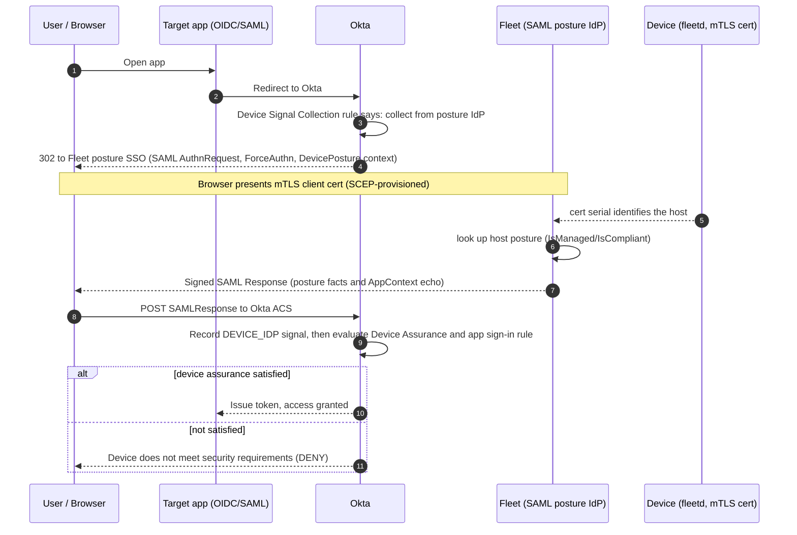

# Okta Device Posture Provider — findings & working recipe

This documents a working, end-to-end proof of concept of Okta's **Device Posture
Provider** (Early Access) integration, where **Fleet acts as a SAML IdP** that
reports device posture (`IsManaged`/`IsCompliant`) to Okta, and Okta gates app
access on it via Device Assurance.

It is the companion to [Okta conditional access research](okta-conditional-access.md),
which compares this approach against the possession-factor approach. This doc is
specifically about the device posture provider path: **what works, the gotchas
that aren't in Okta's docs, and what the production `condaccess` implementation
must do.**

The PoC IdP lives at [`tools/okta-device-posture-poc`](../../../../tools/okta-device-posture-poc).

> **Status:** Validated end-to-end (allow + deny) against a real Okta tenant on
> 2026-06-13. The Okta side is **not** broken — but several load-bearing
> requirements are undocumented or live outside the posture data-contract page.
>
> **Bottom line:** it works, but it offers **no net advantage** over Fleet's
> existing possession-factor path and re-entangles Okta Verify (the very thing we
> wanted to avoid). **Recommendation: stay on the possession-factor path.** See
> [Comparison and recommendation](#comparison-with-the-possession-factor-path--and-recommendation).

## TL;DR

- The device posture provider **works** and can gate access on its own (Okta
  Verify is not required as a posture *source*).
- Okta sends **no device identifier** to the posture IdP. Device identification
  is the provider's responsibility — for Fleet that means the existing **mTLS
  client cert → host** path. The `<Device ID>` attribute in the response is
  informational and ignored for correlation.
- Three requirements cost us the most because they are **not** on the posture
  data-contract page: (1) a **Device Signal Collection rule** must exist to
  invoke the IdP at all; (2) the SAML response must include a **Response-level
  `<Issuer>`** (in addition to the Assertion's); (3) when "Send Okta application
  context" is enabled, the response **must echo `OktaAppInstanceId`/`OktaAppName`**
  back or Okta silently discards the posture.

## How the flow actually works

Key point: **Okta owns device identity; Fleet owns device posture.** Okta knows
*which* device the browser is on (its own device registry / browser device
token), redirects to Fleet, gets posture facts back, and staples them onto that
device as a `DEVICE_IDP` signal. Okta never tells Fleet which device it is.

## Division of responsibility (the core mental model)

| Concern | Owner | Mechanism |
| --- | --- | --- |
| *Which* device is signing in | **Okta** | Okta device registry + browser device token (`dtHash`) |
| *Which* host Fleet should report on | **Fleet** | mTLS client cert serial → `conditional_access_scep_certificates` → host |
| Device *posture* facts | **Fleet** | host's policy compliance → `IsManaged`/`IsCompliant` |
| Applying posture to a policy decision | **Okta** | Device Assurance policy + app sign-in rule |

Because Okta attaches the returned facts to **one** device (the session's),
Fleet must return facts for **that same device**. Fleet can't know which device
Okta picked, so it must independently recognize the browser's device (the mTLS
cert) and return exactly that host's posture.

Consequences:
- **Return exactly one `<Device>`** per response. Not a per-user aggregate, not
  a roster of the user's devices — Okta would mislabel a roster, and an
  aggregate is a security hole (a user with one compliant and one jailbroken
  device must be judged on the device actually in use).
- **Unknown / unrecognized cert → fail closed** with `AuthnFailed` /
  `DEVICE_NOT_MANAGED`. Don't guess.

## Why Okta doesn't specify device identification (and why mTLS)

Okta's posture-provider contract specifies **no** device-identification
mechanism — deliberately. Okta assumes a posture provider already has presence
on the device:

- **Prisma Access Browser** (Palo Alto) — the provider *is* the browser.
- **Workspace ONE** (Omnissa) — ships an agent/tunnel on the device.
- **Okta Verify** (Okta's own equivalent) — device-bound key + localhost
  loopback / deep link (`okta_verify:signed_nonce`, `PROOF_OF_POSSESSION`).

None of them get device identity from the SAML payload. Fleet's `fleetd` is not
a browser and doesn't intercept the redirect, so Fleet needs a way to bind "this
browser session" to "this fleetd host." Options (see
[conditional access research](okta-conditional-access.md)): localhost loopback
(fragile, browser-restricted), a browser extension (per-browser), or **mTLS
client certificate** (cross-browser, device-bound, no extension). Fleet already
chose mTLS for the possession-factor path; the posture-provider path reuses the
exact same SCEP cert → host lookup.

## The SAML response contract (what Okta actually requires)

Okta's [data-contract page](https://help.okta.com/oie/en-us/content/topics/identity-engine/devices/device-assurance-device-posture-idp.htm)
covers the `<Device>/<Posture>/<Fact>` shape but omits several things Okta
enforces. A response that Okta accepts and acts on needs **all** of:

1. **Single enveloped signature on the Assertion**, RSA-SHA256, exclusive c14n.
   Exactly one `<ds:Signature>` — a duplicate makes the enveloped-signature
   transform ambiguous and Okta rejects with *"Unable to validate incoming SAML
   Assertion."* Place it right after `<Issuer>`.
2. **Response-level `<Issuer>`** as the first child of `<samlp:Response>`, **in
   addition to** the Assertion's `<Issuer>`. Both must equal the IdP's
   configured "IdP Issuer URI". A missing Response-level Issuer fails with
   *"The Issuer in the SAML response did not match the Issuer configured for the
   Identity Provider."* (Okta's own example shows Issuer in both places; the
   prose doesn't call it out.)
3. **Audience** = the request's `<Issuer>` (Okta's SP entity ID);
   **Recipient/Destination** = the request's `AssertionConsumerServiceURL`;
   **InResponseTo** = the request ID.
4. The **DevicePosture `AuthnContextDecl`** inside `AuthnStatement`:
   `AuthenticationContextDeclaration` (ns `urn:okta:saml:2.0:DevicePosture`) →
   `Extension` → `Device` → `Posture` → `<Fact Name="IsManaged" .../>`
   (required) and `<Fact Name="IsCompliant" .../>` (optional).
5. **AttributeStatement echoing the app context** — when "Send Okta application
   context" is enabled on the IdP (Okta sends `OktaAppInstanceId`/`OktaAppName`
   in the request `<Extensions>`), the response **must** echo both back as
   `<saml:Attribute>` values, or Okta fails with *"The AppContext response from
   the Identity Provider is invalid"* and **silently drops the posture** (the
   device's `deviceIntegrator` stays `{}`). This requirement is in the separate
   "Send Okta application context" / external-IdP guide, **not** the posture
   data-contract page. **This was the single biggest time sink.**

The `<Device ID>` attribute is a free `xs:string` with no documented correlation
semantics. We tested four values (a phantom string, the hardware UDID, the Okta
device id, and the serial) — **no difference**. It is informational; Okta
correlates by the session's device, not this attribute.

Failure path: to deny an unknown/untrusted device, return
`StatusCode Responder` → `AuthnFailed` with `StatusMessage DEVICE_NOT_MANAGED`.

## The Okta-side configuration (working recipe)

All of these are required; each was a distinct discovery.

1. **Enable EA features:** *Settings → Features* → enable **Device Posture
   Provider** and **Device Signal Collection**. (Without the latter, the
   "Show device signal collection rules" action below doesn't appear.)
2. **Identity Provider:** *Security → Identity Providers → Add → SAML 2.0*, IdP
   Usage = **Device posture provider**. Issuer URI + SSO URL + Destination point
   at Fleet; upload Fleet's IdP signing cert. Request binding HTTP POST works.
   "Response or Assertion" signature verification is fine (we sign the
   assertion).
3. **Endpoint integration:** *Security → Device integrations → Endpoint security
   → Add → Device posture provider*, select macOS.
4. **Device Assurance policy:** require `thirdPartySignalProviders.devicePostureIdP.managed = true`
   (and/or `compliant`). This is the posture-IdP-specific signal — distinct from
   a device's native (Okta Verify) managed status.
5. **Device Signal Collection rule** (the trigger — **without this the posture
   IdP is never invoked**): on the app sign-in policy, *Actions → Show device
   signal collection rules → Add rule*, platform macOS, **Device posture
   identity provider = Fleet**. Enable the ruleset. Per Okta's docs you must
   create one whenever an app sign-in rule uses a device assurance policy with a
   device attribute provider.
6. **App sign-in rule** referencing the device assurance policy. If the rule
   also uses native **Registered/Managed** conditions, Okta requires **Okta
   Verify** to remain enabled in the signal collection rule (it errors
   otherwise). The rule's "Device management" condition must agree with the
   posture you return — a rule set to "Not managed" won't match a device the
   posture IdP reports as `managed=true`.
7. **Catch-all rule = DENY** on the app sign-in policy. Okta rules only *grant*
   access; denial happens when nothing matches and the catch-all denies. With an
   ALLOW catch-all, a non-compliant device that fails the posture rule still
   gets in. Flip it to DENY **only after** the posture rule reliably matches
   healthy devices, or you lock everyone out.

## Evidence (from the validating run)

- **Posture recorded** (the breakthrough): once the AppContext echo was added,
  `policy.evaluate_sign_on` showed
  `deviceIntegrator: {"DEVICE_IDP":{"managed":true,"compliant":true}}` — every
  prior run showed `{}` (Okta was discarding our response).
- **Allow:** with `IsManaged=true`, the Maxmind sign-on matched the posture rule
  ("Test Okta POC"), not the catch-all.
- **Deny:** with `IsManaged=false` and a DENY catch-all, the sign-on produced
  `result: DENY` / `signOnModeEvaluationResult: DENIED` and the user saw "Your
  device doesn't meet the security requirements." The denying event carried
  `DEVICE_IDP.managed=false` — and `user.authentication.auth_via_mfa` (Okta
  Verify FastPass) **succeeded** in the same flow, proving the block was the
  posture policy, not an authenticator failure.
- **Standalone:** with signal-collection `providers=[DEVICE_POSTURE_IDP]` (Okta
  Verify removed as a posture source), Okta still recorded `DEVICE_IDP` and
  denied on it — the posture IdP gates on its own.

## What the production `condaccess` implementation must do

The existing Okta conditional-access (possession-factor) code in
[`ee/server/service/condaccess`](../../../../ee/server/service/condaccess) already
provides almost everything:

- **crewjam/saml `IdentityProvider`** with a custom `SessionProvider` (the
  factor flow already uses this) — handles AuthnRequest parsing, metadata, and
  signing. crewjam already places the signature correctly and avoids the
  duplicate-signature trap the PoC had to work around by hand.
- **SCEP / mTLS host identification** — `X-Client-Cert-Serial` →
  `GetConditionalAccessCertHostIDBySerialNumber` → host. This is the device
  identity the posture provider needs; reuse it unchanged.
- **Signing assets** (`MDMAssetConditionalAccessIDPCert/Key`), the SCEP CA, and
  the Apple profile are shared.

What's new for the posture-provider path:
- A **custom `saml.AssertionMaker`** to emit the `DevicePosture`
  `AuthnContextDecl` (crewjam's default can't — `AuthnContextDecl` is a literal
  TODO in v0.5.1) and the **AppContext `AttributeStatement`** echo, then sign.
- Branch on the request's `RequestedAuthnContext` ==
  `urn:okta:saml:2.0:DevicePosture` to choose posture vs. factor behavior on a
  shared SSO endpoint, plus a second appconfig audience/ACS for the posture IdP.
- Compute the single `<Device>` posture from the cert-identified host's policy
  compliance; on unknown cert, return `AuthnFailed`/`DEVICE_NOT_MANAGED`.
- v1 scope: macOS, `IsManaged`/`IsCompliant` only (Okta's policy engine exposes
  only Managed/Compliant for third-party posture providers; arbitrary custom
  `<Fact>`s are allowed by the XSD but nothing in Okta can reference them).

## Comparison with the possession-factor path — and recommendation

Fleet already ships an Okta conditional-access path where Fleet is a SAML IdP
used as a **possession factor** (IdP authenticator) in an Okta auth method chain.
After building the posture provider end-to-end, it offers **no net advantage**
over that path, and several disadvantages. Both paths use the **same** mTLS
device identity and are both **silent front-channel redirects** on the happy
path — so the posture provider's hypothesized "invisible" benefit is not real.

| | Possession-factor IdP (shipping) | Device Posture Provider (this research) |
| --- | --- | --- |
| Okta feature maturity | GA | **Double Early Access** (Posture Provider + Signal Collection); no SLA, behavior can change |
| Okta config surface | IdP + auth method chain | IdP + endpoint integration + device assurance policy + **signal collection rule** + DENY catch-all |
| Undocumented requirements | none material | Response-level Issuer + **AppContext echo** (posture silently dropped if missing) |
| Okta Verify independence | **clean** — Fleet *is* the factor | **re-entangled** — `DEVICE_IDP` attaches to Okta's device record; Registered/Managed rule conditions force OV back into signal collection |
| Deny / remediation UX | Fleet redirects to its own remediation page | Okta's generic deny screen (optional custom instructions, Okta-controlled) |
| Bypass ("let me in once, fix later") | supported | doesn't map cleanly (would mean asserting compliant when not) |
| Re-check frequency | provider-controllable (auth method chain) | follows Okta's auth-policy re-auth/MFA-timeout (no provider-specific frequency); behavior has **shifted during EA** — reported as both "checks every auth" and "respects reauth frequency" at different times |
| Device health as | a *factor* (semantically awkward) | a policy *condition* (cleaner — the one genuine upside) |

**Independently corroborated.** Kolide ships this integration, and in the
MacAdmins Slack both Kolide and its customers reach the same conclusions:
- An operator who deployed it (Kolide's "Device Posture Provider") asked "what's
  the advantage over the standard method?" and could only offer "fewer
  authenticators / simpler method chains" — i.e., the same minor
  posture-as-condition nicety, no compelling win.
- The re-check **cadence is a moving target** during EA. Kolide reps and
  customers reported it as both "checks on every authentication / no
  provider-specific frequency" *and*, after an Okta change, "no longer prompted
  every time… respecting reauth frequencies." Either way it follows Okta's
  auth-policy settings, not a provider knob, and the behavior is not yet stable —
  matching our own caching/incognito observations.
- Posture is the **device's overall state**, not the actively-used browser/session
  (e.g., "Chrome is out of date" is surfaced as a device signal) — matching the
  one-`<Device>`, device-keyed model above.
- The **AppContext echo corresponds to Okta's "Send app context to external IdPs"
  EA feature.** Providers (including Kolide) currently only *accept and present*
  it (i.e., echo it back, as our PoC does) and cannot yet *act* on it to vary
  posture per app. The echo is therefore required only when that toggle is
  enabled on the IdP.
- Even Kolide considered it **not production-ready** in mid-2025 ("a couple of
  things to polish before you could switch over… not ready yet"), and there is
  **no vendor documentation** beyond Okta's — both consistent with the
  EA-immaturity and undocumented-requirements findings here.

The decisive point is **Okta Verify independence**, which was the original
motivation for exploring alternatives (see
[conditional access research](okta-conditional-access.md)). The posture provider
quietly depends on Okta's device registry — established by Okta Verify on a real
device — for the identity it staples posture onto, and certain rule conditions
require OV in the signal collection rule. The possession-factor path, where Fleet
*is* the factor, needs none of that.

**Recommendation: continue with the possession-factor path; do not adopt the
device posture provider now.** Revisit only if Okta GAs both features and removes
the Okta-Verify / device-registration entanglement. This research is the complete
map for that future evaluation.

## Open questions / known-unknowns

- **Truly Okta-registration-free devices:** every test device was Okta-registered
  (so Okta had a device record to attach `DEVICE_IDP` facts to). Whether the
  posture path works on a device with *zero* Okta registration is untested.
  Likely moot for Fleet (target devices are MDM-enrolled), but worth confirming.
- **Caching / collection cadence:** posture is collected per session, not per
  request. Within a session Okta reuses the collected signal; forcing
  re-collection during testing requires a fresh (incognito) session. The
  production cadence and staleness window need confirmation.
- **Undocumented requirements → file with Okta:** the Response-level Issuer and
  the AppContext echo requirements are not on the posture data-contract page.
  Worth raising with Okta both to confirm they're intended and to get the docs
  fixed.

## Links

- [Integrate Okta with Device Posture Provider](https://help.okta.com/oie/en-us/content/topics/identity-engine/devices/device-assurance-device-posture-idp.htm)
- [Create device signal collection rules](https://help.okta.com/oie/en-us/content/topics/identity-engine/policies/create-device-signal-collection-ruleset.htm)
- [Configure a device signal collection policy (API)](https://developer.okta.com/docs/guides/device-signal-collection-policies/main/)
- [Add device assurance to an app sign-in policy](https://help.okta.com/oie/en-us/content/topics/identity-engine/devices/device-assurance-policy-rule.htm)
- [PoC IdP](../../../../tools/okta-device-posture-poc) · [conditional access research](okta-conditional-access.md) · [testing guide](../../guides/okta-conditional-access-testing.md)
